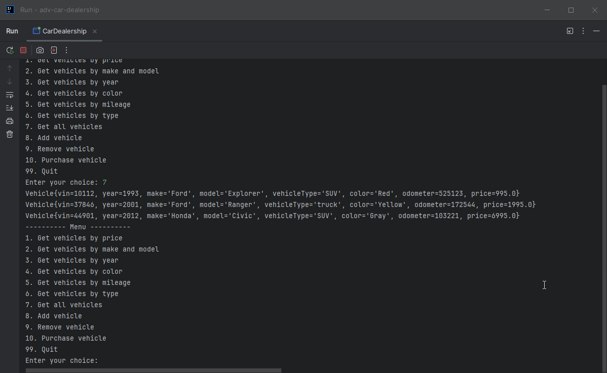
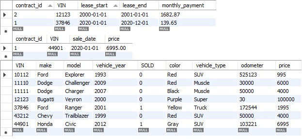

# Car Dealership

## Description of the Project
This is an advanced virtual car dealership, fully outfitted with an inventory of vehicles to search and choose from. The program
reads from a SQL database, populates the dealership, allows for modification, and automatically saves to the database.
Currently, searching allows users to input year, price, mileage, make/model, color, or vehicle type to search for their dream car. 
When a user finds the car of their dreams, they can then write a contract to purchase that vehicle directly or with a lease.

## User Stories
- As an owner, I'd like read input from a database so that I may upload raw information to be swiftly organized and easily modifiable.
- As an owner, I'd like to save my vehicles to a database so that I can easily organize large inventories of vehicles.
- As an owner, I'd like to save written contracts so that I have may retain and organize my Dealership business.
- As an owner, I'd like to remove purchased vehicles from inventory so that any confusion regarding inventory is eased.
  - **As an owner, I'd like to organize all relevant information in a SQL database so that I can stop using outdated CSV files.**

## Setup

### Prerequisites

- IntelliJ IDEA: Ensure you have IntelliJ IDEA installed, which you can download from [here](https://www.jetbrains.com/idea/download/).
- Java SDK: Make sure Java SDK is installed and configured in IntelliJ.
- Dealership Database: Correct MySQL Database must be installed on local system for program to work properly!

### Running the Application in IntelliJ

Follow these steps to get your application running within IntelliJ IDEA:

1. Open IntelliJ IDEA.
2. Select "Open" and navigate to the directory where you cloned or downloaded the project.
3. After the project opens, wait for IntelliJ to index the files and set up the project.
4. Find the main class with the `public static void main(String[] args)` method.
5. Right-click on the file and select 'Run 'YourMainClassName.main()'' to start the application.

## Technologies Used

- Java: Maven 17.
- Java I/O, scanners/file reading.

## Demo

## Future Work

- Improvement of error handling, improvement of performance.
- More dealerships!
- Admin login/functions (View contracts, add/remove vehicle)

## Resources

- [Raymond Maroun's GitHub](https://github.com/RayMaroun/yearup-spring-section-10-2025/tree/master/pluralsight) - Vital Information
- [Previous Java Project](https://github.com/AdampJessie/FinancialTracker) - Very Similar Project, recently completed
- [Potato Sensei](https://chatgpt.com/g/g-681d378b0c90819197b16e49abe384ec-potato-sensei) - Necessary review, wonderful potato puns

## Team Members

- **Adam Jessie** - JDBC Conversion!
- **Raymond Maroun** - Template Project!

## Thanks

- Thank you to instructor Raymond Maroun for unending support and guidance.
- A special thanks to all individuals who view/use this project!
 